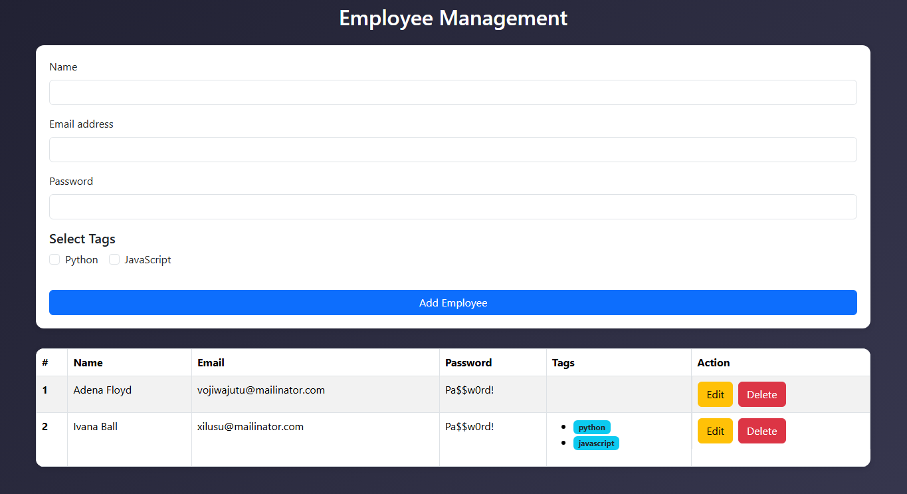

# 🧾 React CRUD App

A simple **Employee Management** CRUD application built with **React**, demonstrating the use of `useState` and `useEffect` hooks. It allows you to **create, read, update, and delete** employee records, with data stored in the **browser's localStorage** for persistence.

---

## 📋 Description

This project is a beginner-friendly React application where users can manage employee data with basic tag selections, and an interactive table. It's styled for a clean interface and works entirely in the browser with no backend.

---

## 🛠️ Tech Stack

- **React**
- **JavaScript (ES6)**
- **Bootstrap 5 
- **LocalStorage** (for storing employee data)
- **Vite** 

---

## 🔗 Live Link

👉 [Live Demo](https://emp-management-sys-pi.vercel.app/)  
> Replace the link above with your actual deployed Vercel link

---

## 📸 Screenshot

  
> Save a screenshot of your running app as `screenshot.png` in the root folder.

---

## 📚 Features

- Add new employees with tags like Python or JavaScript
- Edit existing employee information
- Delete employees
- Data persists across page reloads using `localStorage`
- Clean UI with basic styling

---

## 🚀 Setup

```bash
npm install
npm run dev
